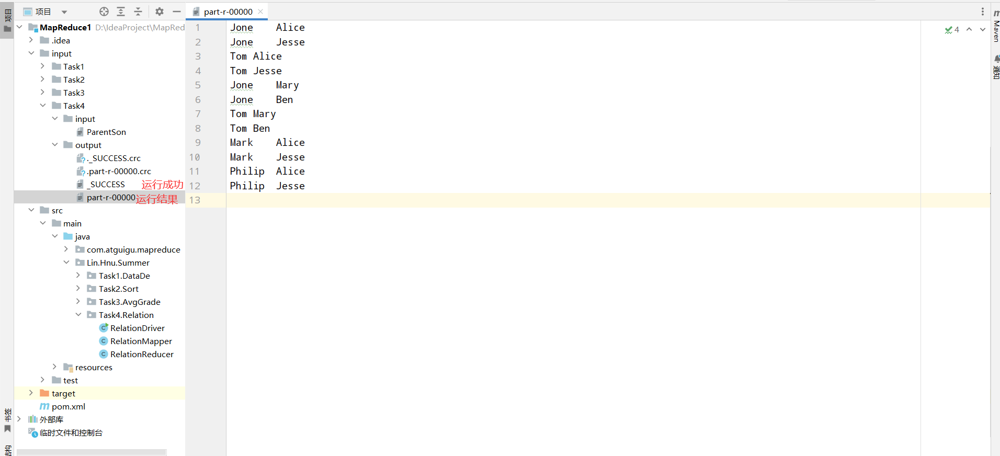

# 一、MapReduce任务

MapReduce分为两个阶段，Map段和Reduce段。以一段字符串`hnu hnu`为例：

1. Map段：
   1. 会将字符串分割成`(hnu, 1)`、`(hnu, 1)`，然后传给Reduce阶段；
   2. Map段会接受两个输入，可以称作为是Keyin、Valuein，一般而言在Map阶段的输入Keyin是一个`LongWritable`的类型，Valuein是一个`Text`的类型，表示在所读取的文本中，这个`Text`相对于开头的偏移量为Keyin
   3. 它还会输出两个，可以称作为Keyout、Valueout，在程序中需要指定所输出的不同类别。
2. Reduce段：
   1. 会对同一组进行处理，也就是我们会得到`(hnu, (1, 1))`，因此可以知道第二个参数是可迭代的。
   2. 同样在Reduce段会接受Map阶段的两个输出，并将它们作为输入处理逻辑后输出。

在编写程序的时候，Hadoop要求还有一个Driver的入口程序，在里面要制定一些东西：

1. 获取Job任务的信息；
2. 设置jar包路径；
3. 关联mapper和reducer；
4. 设置mapper的输出kv类型；
5. 设置reducer的输出kv类型；
6. 设置整体文件的读入路径和写出路径，这个在本地Windows环境运行的时候，可以设置成自己电脑的路径，但是如果传到Hadoop集群上执行的话，那么推荐使用`arg[0]`以及`arg[1]`来动态接收文件路径。
7. 提交job。

**因此如果使用MapReduce进行业务处理的时候，通常包含Mapper、Reducer、Driver这三个类。**

## 1、数据去重

### 分析

我们可以发现，其实从Map段到Reduce段中会有自动帮我们完成去重的工作，因此只需指定：

1. Map的Keyout为`Text`、Valueout为`NullWritale`；
2. Reducer的Keyout为`Text`、Valueout为`NullWritable`

### Driver

```java
package Lin.Hnu.Summer.Task1.DataDe;

import org.apache.hadoop.conf.Configuration;
import org.apache.hadoop.fs.Path;
import org.apache.hadoop.io.IntWritable;
import org.apache.hadoop.io.NullWritable;
import org.apache.hadoop.io.Text;
import org.apache.hadoop.mapreduce.Job;
import org.apache.hadoop.mapreduce.lib.input.FileInputFormat;
import org.apache.hadoop.mapreduce.lib.output.FileOutputFormat;

import java.io.IOException;

public class DataDeDriver{
    public static void main(String[] args) throws IOException, InterruptedException, ClassNotFoundException {
        // 1 获取job
        Configuration conf = new Configuration();
        Job job = Job.getInstance(conf);

        // 设置jar包路径
        job.setJarByClass(DataDeDriver.class);

        //3 关联mapper和reducer
        job.setMapperClass(DataDeMapper.class);
        job.setReducerClass(DataDeReducer.class);

        // 4 设置map的输出kv类型
        job.setMapOutputKeyClass(Text.class);
        job.setMapOutputValueClass(NullWritable.class);

        // 5 设置最终输出的kv类型
        job.setOutputValueClass(Text.class);
        job.setOutputValueClass(NullWritable.class);

        // 6 设置输入路径以及输出路径
        FileInputFormat.setInputPaths(job, new Path("arg[0]"));
        FileOutputFormat.setOutputPath(job, new Path("agr[1]"));

        // 7 提交job
        boolean result = job.waitForCompletion(true);

        System.exit(result ? 0 : 1);
    }
}

```

### Mapper

```java
package Lin.Hnu.Summer.Task1.DataDe;

import org.apache.hadoop.io.IntWritable;
import org.apache.hadoop.io.LongWritable;
import org.apache.hadoop.io.NullWritable;
import org.apache.hadoop.io.Text;
import org.apache.hadoop.mapreduce.Mapper;

import java.io.IOException;

/*
* Keyin: LongWritable 单词在文本中的偏移量
* Valuein: Text 文本
* Keyout: Text
* Valueout: IntWritable
* */

public class DataDeMapper extends Mapper<LongWritable, Text, Text, NullWritable> {
    private IntWritable outV = new IntWritable(1);
    @Override
    protected void map(LongWritable key, Text value, Mapper<LongWritable, Text, Text, NullWritable>.Context context) throws IOException, InterruptedException {
        context.write(value, NullWritable.get()); // 直接写出就好了
    }
}
```

### Reducer

```java
package Lin.Hnu.Summer.Task1.DataDe;

import org.apache.hadoop.io.IntWritable;
import org.apache.hadoop.io.NullWritable;
import org.apache.hadoop.io.Text;
import org.apache.hadoop.mapreduce.Reducer;

import java.io.IOException;


/**
 * Keyin: map阶段的keyout  即 text
 * Valuein: map阶段的valueout 即IntWritable
 * Keyout: Text
 * Valueout: NullWritable
 */
public class DataDeReducer extends Reducer<Text, IntWritable, Text, NullWritable>{
    @Override
    protected void reduce(Text key, Iterable<IntWritable> values, Reducer<Text, IntWritable, Text, NullWritable>.Context context) throws IOException, InterruptedException {
        context.write(key, NullWritable.get());
    }
}
```

### 测试数据

输入数据：

```
2012-3-1 a
2012-3-1 a
2012-3-1 a
2012-3-2 b
2012-3-2 b
2012-3-6 b
2012-3-6 b
2012-3-6 b
2012-3-1 a
2012-3-2 b
2012-3-6 b
2012-3-1 a
2012-3-1 a
2012-3-6 b
2012-3-1 a
2012-3-6 b
```

输出：


## 2、数据排序

### 分析

1. 我们应该知道的是mapreduce在map阶段会默认对输出的key进行排序，该排序是快排，如果传入的是字符串的话就是按照字典序排序了，因此我们应该传入整型。
2. 在reduce阶段对于每个相同的输入key都会调用一次reduce方法，所以只需要声明一个`cnt`表示编号，每次调用的时候动态+1即可。

### Driver

```java
package Lin.Hnu.Summer.Task2.Sort;

import org.apache.hadoop.conf.Configuration;
import org.apache.hadoop.fs.Path;
import org.apache.hadoop.io.IntWritable;
import org.apache.hadoop.io.NullWritable;
import org.apache.hadoop.io.Text;
import org.apache.hadoop.mapreduce.Job;
import org.apache.hadoop.mapreduce.lib.input.FileInputFormat;
import org.apache.hadoop.mapreduce.lib.output.FileOutputFormat;

import java.io.IOException;

public class SortDriver {
    public static void main(String[] args) throws IOException, InterruptedException, ClassNotFoundException {
        // 1 获取job
        Configuration conf = new Configuration();
        Job job = Job.getInstance(conf);

        // 2 设置jar包路径
        job.setJarByClass(SortDriver.class);

        // 3 关联mapper和reducer
        job.setMapperClass(SortMapper.class);
        job.setReducerClass(SortReducer.class);

        // 4 设置mapper的kv输出
        job.setMapOutputKeyClass(IntWritable.class);
        job.setMapOutputValueClass(NullWritable.class);

        // 5 设置reducer的kv输出
        job.setOutputKeyClass(IntWritable.class);
        job.setOutputValueClass(IntWritable.class);

        // 6 设置输入输出路径
        FileInputFormat.setInputPaths(job, new Path("D:\\IdeaProject\\MapReduce1\\input\\Task2\\input"));
        FileOutputFormat.setOutputPath(job, new Path("D:\\IdeaProject\\MapReduce1\\input\\Task2\\output"));

        // 7 提交job
        boolean result = job.waitForCompletion(true);
        System.exit(result ? 0 : 1);
    }
}
```

### Mapper

```java
package Lin.Hnu.Summer.Task2.Sort;

import org.apache.hadoop.io.IntWritable;
import org.apache.hadoop.io.LongWritable;
import org.apache.hadoop.io.NullWritable;
import org.apache.hadoop.io.Text;
import org.apache.hadoop.mapreduce.Mapper;

import java.io.IOException;

public class SortMapper extends Mapper<LongWritable, Text, IntWritable, NullWritable> {
    private IntWritable outV = new IntWritable(1);

    @Override
    protected void map(LongWritable key, Text value, Mapper<LongWritable, Text, IntWritable, NullWritable>.Context context) throws IOException, InterruptedException {
        String line = value.toString();
        outV.set(Integer.parseInt(line));
        context.write(outV, NullWritable.get());
    }
}

```

### Reducer

```java
package Lin.Hnu.Summer.Task2.Sort;

import org.apache.hadoop.io.IntWritable;
import org.apache.hadoop.io.NullWritable;
import org.apache.hadoop.io.Text;
import org.apache.hadoop.mapreduce.Reducer;

import java.io.IOException;

public class SortReducer extends Reducer<IntWritable, NullWritable, IntWritable, IntWritable> {
    private IntWritable outK = new IntWritable();
    private Integer cnt = 1;

    @Override
    protected void reduce(IntWritable key, Iterable<NullWritable> values, Reducer<IntWritable, NullWritable, IntWritable, IntWritable>.Context context) throws IOException, InterruptedException {
        outK.set(cnt);
        cnt ++;
        context.write(outK, key);
    }
}
```

### 测试数据


运行的输出：


## 3、平均成绩

### 分析

由于map阶段会将每一行处理成对应的键值对，所以在reduce阶段进行输出值的综合即可。

### Driver

```java
package Lin.Hnu.Summer.Task3.AvgGrade;

import org.apache.hadoop.conf.Configuration;
import org.apache.hadoop.fs.Path;
import org.apache.hadoop.io.DoubleWritable;
import org.apache.hadoop.io.IntWritable;
import org.apache.hadoop.io.Text;
import org.apache.hadoop.mapreduce.Job;
import org.apache.hadoop.mapreduce.lib.input.FileInputFormat;
import org.apache.hadoop.mapreduce.lib.output.FileOutputFormat;

import java.io.IOException;

public class AvgGradeDriver {
    public static void main(String[] args) throws IOException, InterruptedException, ClassNotFoundException {
        // 1 获取job
        Configuration conf = new Configuration();
        Job job = Job.getInstance(conf);

        // 2 设置jar包路径
        job.setJarByClass(AvgGradeDriver.class);

        // 3 关联 mapper 和 reducer
        job.setMapperClass(AvgGradeMapper.class);
        job.setReducerClass(AvgGradeReducer.class);

        // 4 设置mapper输出kv
        job.setMapOutputKeyClass(Text.class);
        job.setMapOutputValueClass(IntWritable.class);

        // 5 设置 reducer输出kv
        job.setOutputKeyClass(Text.class);
        job.setOutputValueClass(DoubleWritable.class);

        // 6 设置输入输出路径
        FileInputFormat.setInputPaths(job, new Path("D:\\IdeaProject\\MapReduce1\\input\\Task3\\input"));
        FileOutputFormat.setOutputPath(job, new Path("D:\\IdeaProject\\MapReduce1\\input\\Task3\\output"));

        // 7 提交job
        boolean result = job.waitForCompletion(true);
        System.exit(result ? 0 : 1);
    }
}
```

### Mapper

```java
package Lin.Hnu.Summer.Task3.AvgGrade;

import org.apache.hadoop.io.IntWritable;
import org.apache.hadoop.io.LongWritable;
import org.apache.hadoop.io.Text;
import org.apache.hadoop.mapreduce.Mapper;

import java.io.IOException;

/**
 * Keyin: 偏移量
 * Valuein: 文本的一行
 * Keyout: 姓名
 * Valueout: 当前人的成绩
 */
public class AvgGradeMapper extends Mapper<LongWritable, Text, Text, IntWritable> {
    private Text outK = new Text();
    private IntWritable outV = new IntWritable();
    @Override
    protected void map(LongWritable key, Text value, Mapper<LongWritable, Text, Text, IntWritable>.Context context) throws IOException, InterruptedException {
        String line = value.toString();
        String[] words = line.split("    ");

        outK.set(words[0]);
        outV.set(Integer.parseInt(words[1]));
        context.write(outK, outV);
    }
}
```

### Reducer

```java
package Lin.Hnu.Summer.Task3.AvgGrade;

import org.apache.hadoop.io.IntWritable;
import org.apache.hadoop.io.LongWritable;
import org.apache.hadoop.io.Text;
import org.apache.hadoop.mapreduce.Mapper;

import java.io.IOException;

/**
 * Keyin: 偏移量
 * Valuein: 文本的一行
 * Keyout: 姓名
 * Valueout: 当前人的成绩
 */
public class AvgGradeMapper extends Mapper<LongWritable, Text, Text, IntWritable> {
    private Text outK = new Text();
    private IntWritable outV = new IntWritable();
    @Override
    protected void map(LongWritable key, Text value, Mapper<LongWritable, Text, Text, IntWritable>.Context context) throws IOException, InterruptedException {
        String line = value.toString();
        String[] words = line.split("    ");

        outK.set(words[0]);
        outV.set(Integer.parseInt(words[1]));
        context.write(outK, outV);
    }
}
```

### 测试数据

输入：


输出：


## 4、单表连接

### 分析

1. 给一个数据表项代表父子关系，请我们找出所有的爷孙关系。我的思路是以某一位父亲作为中间键，通过它既能找到他的儿子，也能找到他的父亲。

2. 由于map阶段后，Hadoop底层将所有相同的keyout值对应的valueout组合成一个迭代器传送给reduce阶段，所以某一位父亲就作为这里的keyout，而它对应的儿子与父亲则作为valueout，我们在map阶段会输出2次。

3. 为了方便在reduce阶段辨别传入的键值对是父-子关系还是子-父关系，人为在对应的value后面添加一个标志位，0代表父-子关系，1代表子-父关系。
4. 在reduce阶段利用两个`ArrayList` `grandsons`和`grandparents`收集对应的信息，如果标志位为0，那么代表此时的value是当前key的儿子，因此插入grandsons；如果是1，则value是当前key的父亲，因此插入grandparents。
5. 最后嵌套遍历，先遍历`grandsons`再遍历`grandparents`即可找出所有的爷孙关系。

---

这么说比较抽象，举一个例子：

比如我们有父子关系（左子右父）：`<Tom, Jack>` `<Jack, Alice>`

1. 那么在map阶段我们应该输出，`<Jack, "Tom 0">` `<Jack, "Alice 1">` `<Tom, "Jack 1">` `<Alice, "Jack 0">`；

2. 经过map阶段，在底层整合成：`<Jack, ["Tom 0", "Alice 1"]>` `<Tom, ["Jack 1"]>` `<Alice, ["Jack 0"]>`传给reduce阶段；
3. 在reduce阶段，有效的一组信息是`grandsons = [Tom]` `grandparents = [Alice]` 所以最后输出爷孙关系（左孙右爷）`<Tom, Alice>`

### Driver

```java
package Lin.Hnu.Summer.Task4.Relation;

import org.apache.hadoop.conf.Configuration;
import org.apache.hadoop.fs.Path;
import org.apache.hadoop.io.Text;
import org.apache.hadoop.mapreduce.Job;
import org.apache.hadoop.mapreduce.lib.input.FileInputFormat;
import org.apache.hadoop.mapreduce.lib.output.FileOutputFormat;

import java.io.IOException;

public class RelationDriver {
    public static void main(String[] args) throws IOException, InterruptedException, ClassNotFoundException {
        // 1 获取job
        Configuration conf = new Configuration();
        Job job = Job.getInstance(conf);

        // 2 设置jar包路径
        job.setJarByClass(RelationDriver.class);

        // 3 关联mapper以及reducer
        job.setMapperClass(RelationMapper.class);
        job.setReducerClass(RelationReducer.class);

        // 4 设置mapper输出格式
        job.setMapOutputKeyClass(Text.class);
        job.setMapOutputValueClass(Text.class);

        // 5 设置reducer输出格式
        job.setOutputKeyClass(Text.class);
        job.setOutputValueClass(Text.class);

        // 6 设置输入输出路径
        FileInputFormat.setInputPaths(job, new Path("D:\\IdeaProject\\MapReduce1\\input\\Task4\\input"));
        FileOutputFormat.setOutputPath(job, new Path("D:\\IdeaProject\\MapReduce1\\input\\Task4\\output"));

        // 7 提交job
        boolean result = job.waitForCompletion(true);
        System.exit(result ? 0 : 1);
    }
}
```

### Mapper

```java
package Lin.Hnu.Summer.Task4.Relation;

import org.apache.hadoop.io.LongWritable;
import org.apache.hadoop.io.Text;
import org.apache.hadoop.mapreduce.Mapper;

import java.io.IOException;

/**
 * Keyout: 父亲的名字                         | 儿子的名字
 * Valueout: 儿子的名字 + '0' 表示是父子关系    | 父亲的名字 + '1'
 */
public class RelationMapper extends Mapper<LongWritable, Text, Text, Text> {
    private Text outV = new Text();
    private Text outK = new Text();
    private String tmpv;
    @Override
    protected void map(LongWritable key, Text value, Mapper<LongWritable, Text, Text, Text>.Context context) throws IOException, InterruptedException {
        String line = value.toString();
        String[] words = line.split(" ");
        // Tom Jack
        tmpv = String.format("%s %d", words[1], 1); // 表示是子父关系 <Tom, "Jack 1">
        outK.set(words[0]);
        outV.set(tmpv);
        context.write(outK, outV);
        outK.set(words[1]);
        tmpv = String.format("%s %d", words[0], 0); // 表示是父子关系 <Jack, "Tom 0">
        outV.set(tmpv);
        context.write(outK, outV);
    }
}

```

### Reducer

```java
package Lin.Hnu.Summer.Task4.Relation;

import org.apache.hadoop.io.Text;
import org.apache.hadoop.mapreduce.Reducer;

import java.io.IOException;
import java.util.ArrayList;

public class RelationReducer extends Reducer<Text, Text, Text, Text> {
    private String MapoutV;
    private Text outK = new Text();
    private Text outV = new Text();
    @Override
    protected void reduce(Text key, Iterable<Text> values, Reducer<Text, Text, Text, Text>.Context context) throws IOException, InterruptedException {
        ArrayList<String> grandparents = new ArrayList<>();
        ArrayList<String> grandsons = new ArrayList<>();
        for (Text value : values) {
            MapoutV = value.toString(); // ["Tom 0", "Alice 1"]
            String[] words = MapoutV.split(" ");
            String t1 = words[0], t2 = words[1];
            if(t2.equals("1")) { // 表明是子父关系 MapoutK 是儿子 MapoutV是父亲 Alice是爷爷
                grandparents.add(t1);
            }else { // 表明是父子关系 MapoutK是父亲 MapoutV是儿子 Tom是孙子
                grandsons.add(t1);
            }
        }
        for (String grandson : grandsons) {
            for (String grandparent : grandparents) {
                outK.set(grandson);
                outV.set(grandparent);
                context.write(outK, outV);
            }
        }
    }
}
```

### 测试数据

输入：


输出：



# 二、使用javaAPI操作hdfs

Hdfs是指Hadoop分布式文件系统，使用将超大文件分成小文件来存的思想。这个任务比较简单，不用像mapreduce一样来写三个类。

## 1. 为什么要使用javaAPI来操作？

hdfs的操作无非涉及传统Linux中的`mkdir`、`rm`、`put(上传)`等操作，一般只需要一行命令就可以了，为什么还要使用繁琐的javaAPI来操作呢？

这是因为我们之前是通过xshell远程连接的Hadoop集群,但是xshell毕竟是一种终端,手动输入并不是非常方便,并且在正常开发中一般是不会使用到对应的命令行的，所以熟悉api是必须的。

这个客户端的大致思路是先连接上Hadoop的namenode节点,这是因为它负责接收客户端的请求.

客户端的思路大致如下:

1. 获取一个客户端对象;
2. 执行相关命令;
3. 关闭资源即可.


## 2. 具体实现细节

```java
@Test
public void FileUpload() throws URISyntaxException, IOException, InterruptedException {
    init();
    /**
     * @param1: Boolean Whether to delete source file
     * @param2: Boolean Whether to overwrite destination file if already exists
     * @param3: Path of source file
     * @param4: Path of destination file
     */
    fs.copyFromLocalFile(false, false, new Path("D:\\IdeaProject\\MapReduce1\\input\\Task1\\Input\\input1"), new Path( "/"));
    close();
}
```

由于每个函数都涉及获取客户端对象和一些初始化信息,所以将它们单独封装起来.

```java
@Before
public void init() throws URISyntaxException, IOException, InterruptedException {
    // 连接集群的namenode地址
    URI uri = new URI("hdfs://hadoop102:8020");// hadoop102内部的通信端口是8020
    // 创建一个配置文件
    Configuration configuration = new Configuration();

    // 指定用户
    String usr = "lin";

    // 1 拿到客户端对象
    fs = FileSystem.get(uri, configuration, usr);
}
@After
public void close() throws IOException {
    fs.close();
}
```

这样就能方便的测试了.

## 3. 测试

### 3.1 创建文件夹以及删除文件夹

```java
@Test
public void Filemkdir() throws URISyntaxException, IOException, InterruptedException {
    //获取资源
    init();
    // 2 创建一个文件夹
    fs.mkdirs(new Path("/testmkdir"));
    // 3 关闭资源
    close();
}

@Test
public void FileRmdir() throws URISyntaxException, IOException, InterruptedException {
    init();
    /**
     * @param1: file path
     * @param1: Whether to delete directory recursively
     */
    fs.delete(new Path("/testmkdir"), true);
    close();
}
```

直接点击这个就可以了,不过要保证Hadoop集群是打开的.


## 3.2 测试读取文件

```java
@Test
public void FileDetail() throws IOException, URISyntaxException, InterruptedException {
    init();
    /**
     * @param1: path of file
     * @param2: Whether recursively
     */
    RemoteIterator<LocatedFileStatus> files = fs.listFiles(new Path("/"), true);

    // 遍历
    while (files.hasNext()) {
        LocatedFileStatus fileStatus = files.next();
        if(fileStatus.isFile()){
            Path path = fileStatus.getPath();
            System.out.printf("-------File name is [%s]--------\n", fileStatus.getPath().getName());
            fs.open(path);
            FSDataInputStream in = fs.open(path);
            BufferedReader d = new BufferedReader(new InputStreamReader(in));
            String content;
            while((content = d.readLine()) != null) {
                System.out.println(content);
            }
            d.close();
            in.close();
        }
    }
    close();
}
```


读取文件我是将其输出到stdout的,并且由于Hadoop有tmp文件夹中有大量系统信息,也会被一并输出这会导致输出并不是那么美观,目前正在尝试寻找办法解决不读取tmp文件夹但是仍读取其他文件夹的办法.

# 三、使用javaAPI去操作hbase

## 1. 使用列式存储的hbase

目前大数据的存储方案有两种，分别是列式存储和行式存储，行式存储我们已经学习过，就是MongoDB这类型的关系型数据库；而在hbase中，使用的不再是行式存储而转变为列式存储。它们的最大不同就是行式数据库一行一行的存储，而列式数据库是一列一列的存储。

![行存储 VS 列存储[通俗易懂]](./实验报告/68056e556a1d1cfc66f2e93ddd2ee796.jpg)

### 1.1 列族与列

1. 列族是hbase表中的逻辑分组，通常包含一个或多个列，所有属于同一列族的列在存储上物理相邻。
2. 列是列族的子元素，实际存储数据的地方，是hbase中的基本数据单元。

## 2. 为什么要使用api？

跟hdfs同理，在正常的开发中一般不会使用命令行工具，而是会使用对应的api来操作，因此熟悉hbase的api也是必须的。

并且发现如果在命令使用hbase是非常难受的，命令一旦错误就会导致就会退出hbase的操作shell，非常的不方便。

## 3. 使用多线程连接

由于hbase的连接在官网中是一个重量级的连接，因此使用单线程的并不好会有瓶颈问题，因此官网建议使用`static`的方法来在编译的时候就创建连接，这样能在一定程度上提高效率。

```java
package Lin.Hnu.Summer;

import org.apache.hadoop.conf.Configuration;
import org.apache.hadoop.hbase.client.Connection;
import org.apache.hadoop.hbase.client.ConnectionFactory;

import java.io.IOException;

public class HbaseConnection {
    // 多线程连接 类似于单例模式 统一使用一个连接
    // 声明一个静态属性
    public static Connection connection = null;
    static {
        // 1 创建同步（默认）连接
        try {
            // 使用读取本地文件的形式 在resources中的hbase-site.xml中
            connection = ConnectionFactory.createConnection();
        } catch (IOException e) {
            throw new RuntimeException(e);
        }

    }

    public static void closeConnection() throws IOException {
        // 判断连接是否为空
        if(connection != null)
            connection.close();
    }

    public static void main(String[] args) throws IOException {

        // 直接使用创建好的连接 不在main线程中创建
        System.out.println(HbaseConnection.connection);

        // 关闭
        HbaseConnection.closeConnection();

    }
}
```

## 4. 开启hbase

hbase需要基于Hadoop、zookeeper来使用，所以首先要打开这两个设置，然后再打开hbase自己，下面是我集群3个节点的配置：


## 5. 开始任务

### 5.1 创建表格并创建列族和列

```java
    /**
     * We should also use namespace and name of table to describe a table, and use name of columns to more precisely create a table.
     * @param namespace
     * @param tableName
     * @param columnFamilies
     */
    public static void CreateTable(String namespace, String tableName, String... columnFamilies) throws IOException {
        // In hbase, we should have at least one column. But the size of columnFamilies will be 0 if we use changeable args.
        // So we should check out whether its size is 0 before we start creating.
        if(columnFamilies.length == 0) {
            System.out.println("In hbase, we should have at least one column when creating table");
            return ;
        }

        // check whether table exists
        if(isTableExists(namespace, tableName)) {
            System.out.printf("The table %s already exists\n", tableName);
            return ;
        }

        // 1 get admin
        Admin admin = connection.getAdmin();


        // 2 Use method to create table

        // 2.1 Create builder of table
        TableDescriptorBuilder tableDescriptorBuilder = TableDescriptorBuilder.newBuilder(TableName.valueOf(namespace, tableName));

        // 2.2 add information
        for (String columnFamily : columnFamilies) {
            // 2.3 create column family description
            ColumnFamilyDescriptorBuilder columnFamilyDescriptorBuilder = ColumnFamilyDescriptorBuilder.newBuilder(Bytes.toBytes(columnFamily));
            // 2.4 add
            columnFamilyDescriptorBuilder.setMaxVersions(3);

            tableDescriptorBuilder.setColumnFamily(columnFamilyDescriptorBuilder.build());
        }


        try {
            admin.createTable(tableDescriptorBuilder.build());
        } catch (IOException e) {
            throw new RuntimeException(e);
        }
        System.out.printf("Table %s successfully creates\n", tableName);

        // 3 close
        admin.close();
    }
```

#### 5.1.1 在main方法中测试

```java
public static void main(String[] args) throws IOException {
    // Test the method we create above.
    CreateTable("HNUSummer", "Workers", "info");

    HbaseConnection.closeConnection();
}
```

再返回虚拟机：

```
hbase shell
>> list
```


可发现成功创建该表格。还可以使用：

```
>> describe 'HNUSummer:Workers'
```

来查看对应的表格信息


### 5.2 根据data.txt插入数据

首先观察一下`data.txt`中都是一些什么类型的数据：


可以发现它的数据是键值对的，如果要解析这段字符串获取对应的键值信息的话，那么比较好的方法是使用正则表达式进行一一匹配，然后再逐个写入。

根据API插入数据：

```java
public static void PutData(String namespace, String tablename, String rowKey, String columnFamily, String columnName, String value) throws IOException {
    if(! HbaseDDL.isTableExists(namespace, tablename)) {
        System.out.printf("Table %s doesn't exist\n", tablename);
        return ;
    }
    // 1 If we want to change data in hbase, we should use connection.table
    Table table = connection.getTable(TableName.valueOf(namespace, tablename));

    // 2 Create object put
    Put put = new Put(Bytes.toBytes(rowKey));

    put.addColumn(Bytes.toBytes(columnFamily), Bytes.toBytes(columnName), Bytes.toBytes(value));
    try {
        table.put(put);
    } catch (IOException e) {
        throw new RuntimeException(e);
    }

    // close
    table.close();
}
```

然后再调用API：

```java
public static void main(String[] args) throws IOException {

    String filepath = "D:\\IdeaProject\\Hbase\\HbaseClient\\src\\static\\data.txt";
    BufferedReader bufferedReader = new BufferedReader(new FileReader(filepath));
    String line;
    // use regex to get KV pairs.
    String pattern = "\"(\\w+)\":\"([^\"]+)\""; // 正则表达式
    Pattern compile = Pattern.compile(pattern);
    int cnt = 1;
    while((line = bufferedReader.readLine()) != null) {
        if(line.equals("[") || line.equals("]")) continue;
        Matcher matcher = compile.matcher(line);
        while(matcher.find()){
            String key = matcher.group(1), value = matcher.group(2);
            PutData(MyNameSpace, MyTableName, String.valueOf(cnt), "info", key, value);
        }
        cnt ++;
    }
    bufferedReader.close();
}
```

最后登录hbase：

```
hbase shell
>> list "HNUSummer:Workers"
```


数据成功插入，由于数据量比较大，因此不一一展示。

### 5.3 查询数据

提供对应的列族和列名就能唯一查到。

```java
public static void GetData(String namespace, String tablename, String rowKey, String columnFamily, String columnName) throws IOException {
    Table table = connection.getTable(TableName.valueOf(namespace, tablename));

    Get get = new Get(Bytes.toBytes(rowKey));

    get.addColumn(Bytes.toBytes(columnFamily), Bytes.toBytes(columnName));
    try {
        Result result = table.get(get);
        Cell[] cells = result.rawCells();
        // print directly
        for (Cell cell : cells) {
            String s = new String(CellUtil.cloneValue(cell));
            System.out.println(s);
        }
    } catch (IOException e) {
        throw new RuntimeException(e);
    }

    connection.close();
}
```

测试：

```java
public static void main(String[] args) throws IOException {
    GetData(MyNameSpace, MyTableName, "25", "info", "work_order_no");
}
```


输出结果。

### 5.4删除数据

```java
public static void DelData(String namespace, String tablename, String rowKey, String columnFamily, String columnName) throws IOException {
    Table table = connection.getTable(TableName.valueOf(namespace, tablename));
    Delete delete = new Delete(Bytes.toBytes(rowKey));
    delete.addColumn(Bytes.toBytes(columnFamily), Bytes.toBytes(columnName));
    try {
        table.delete(delete);
    } catch (IOException e) {
        throw new RuntimeException(e);
    }


    connection.close();
}
```

测试：

```java
public static void main(String[] args) throws IOException {
//        GetData(MyNameSpace, MyTableName, "25", "info", "work_order_no");
    DelData(MyNameSpace, MyTableName, "25", "info", "work_order_no");
}
```

查看一下确实删除掉了：


# 出现的问题

## 1. ens33网卡消失

ens33网卡是配置ip与端口的网卡，非常重要，没有他集群就需要重新配置，某天登录的时候意外发现有一个机器通过xshell连接不上。

检查发现是ens33这个网卡不见了。


通过重启网络相关服务成功找到了ens33这个网卡并连接上了此机器。


命令如下：

```sh
systemctl stop NetworkManager
systemctl restart network.service
service network restart
```

